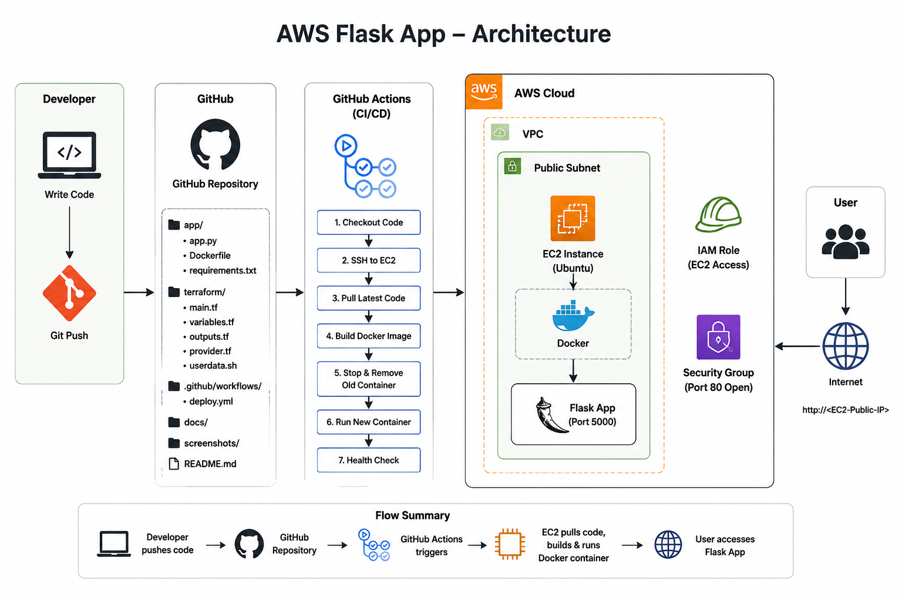
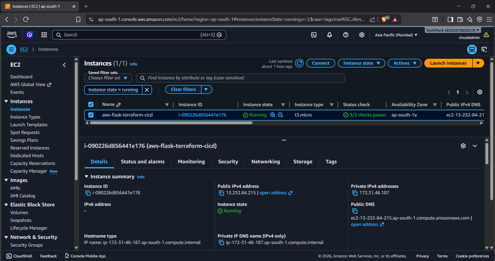
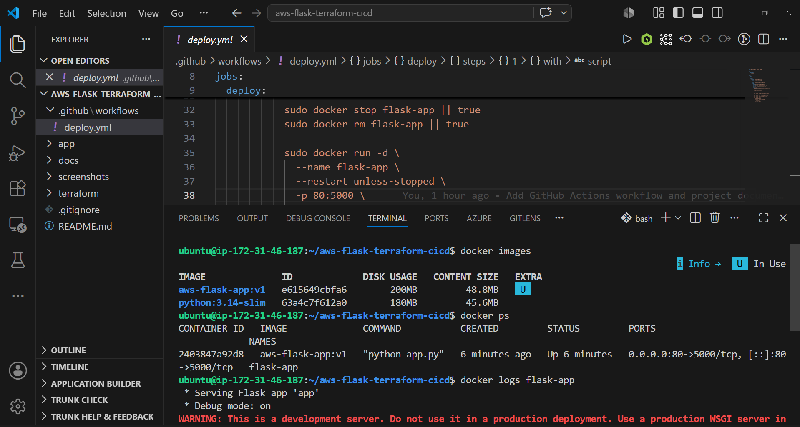
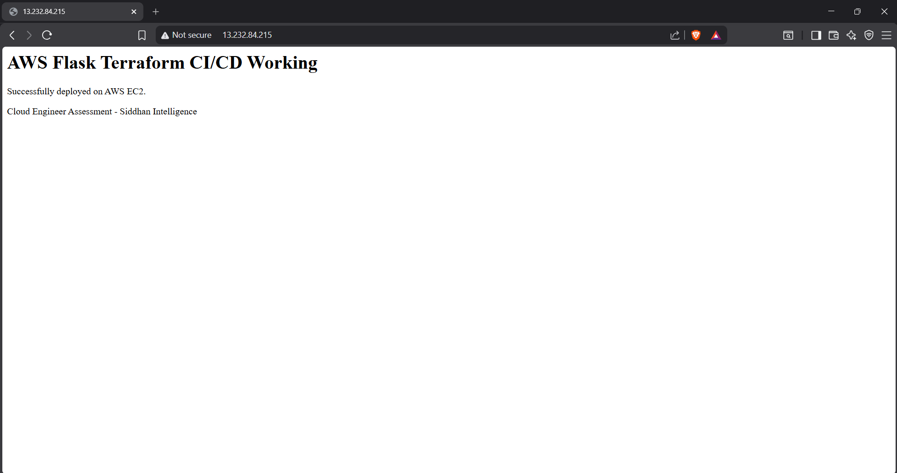
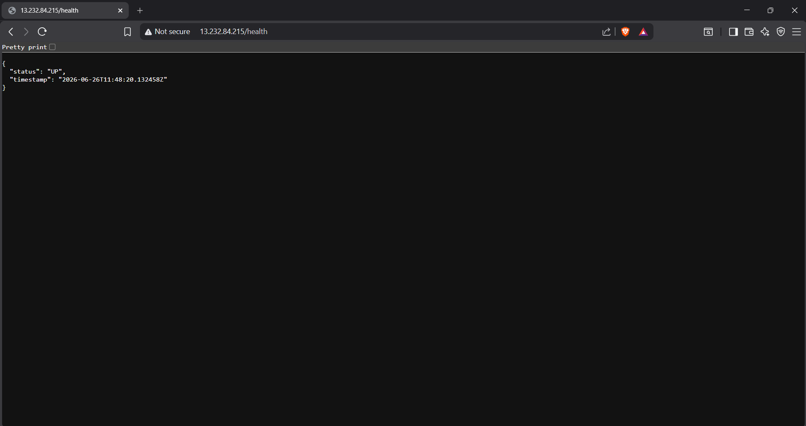
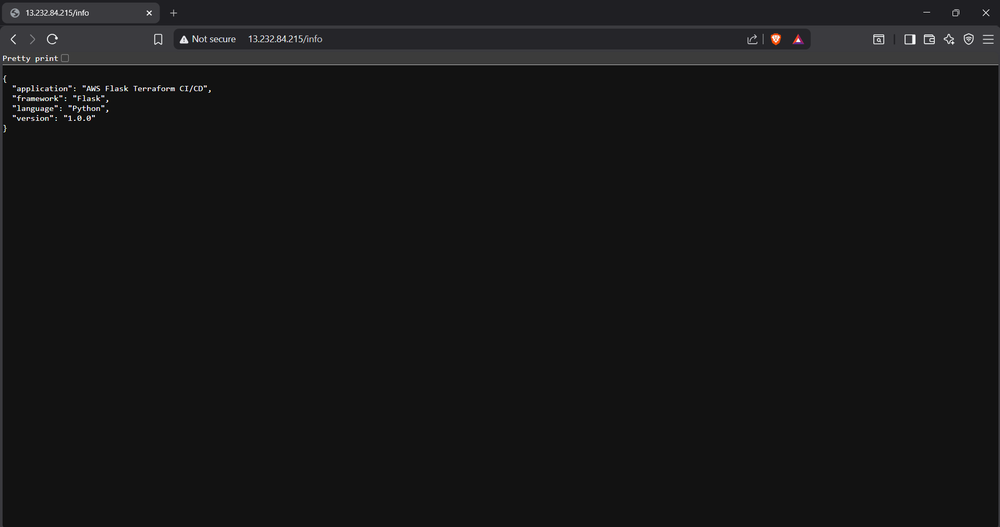
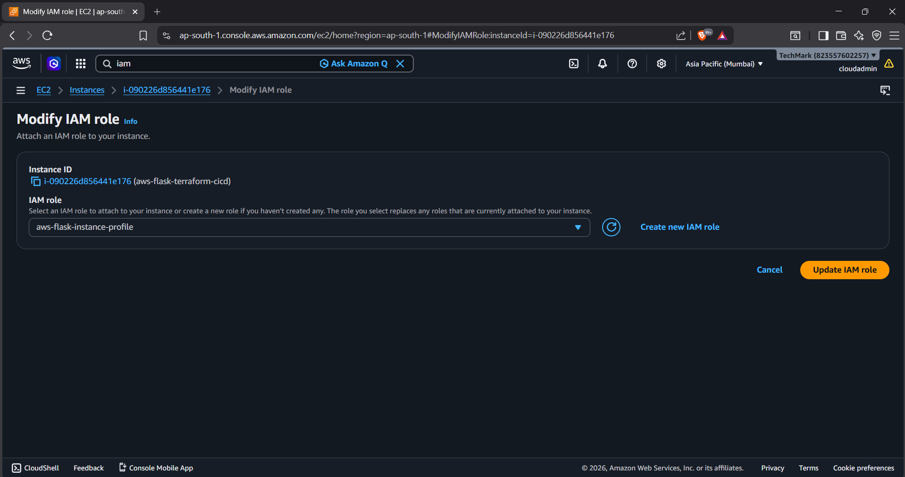
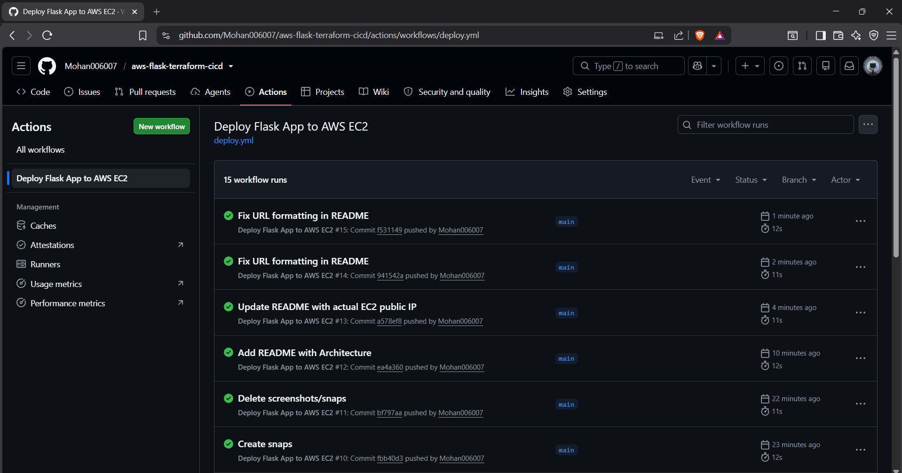

# AWS Flask App – Terraform & CI/CD Deployment

This project is part of my Cloud Engineer technical assessment for **Siddhan Intelligence**. The goal was to build and deploy a simple Python Flask application on AWS using Infrastructure as Code and an automated CI/CD pipeline.

I used Terraform to provision the cloud infrastructure, Docker to containerize the app, and GitHub Actions to handle automatic deployments whenever I push code to the main branch.

---

## What This Project Does

A developer pushes code to GitHub. GitHub Actions picks that up, SSHs into the EC2 instance, pulls the latest code, builds a Docker image, and runs a new container — all automatically. The Flask app then serves traffic over HTTP on port 80, accessible from anywhere on the internet.

---

## Architecture



## 📸 Screenshots

## EC2 Instance



## Docker Container



## Live Application



## Health Endpoint



## Info Endpoint



## IAM Role



## GitHub Actions CI/CD



The flow is straightforward:

1. I write code and push to GitHub
2. GitHub Actions triggers the deployment pipeline
3. It SSHs into the EC2 instance and pulls the latest code
4. Docker builds a fresh image from the Dockerfile
5. The old container is stopped and replaced with the new one
6. Flask app runs inside Docker on port 5000, exposed on port 80
7. Users can access the app at `http://13.232.84.215`

The EC2 instance sits inside a VPC in a public subnet. A Security Group allows HTTP (port 80) and SSH (port 22) traffic. An IAM Role is attached to the instance with CloudWatch permissions so it can push logs and metrics.

---

## Project Structure

```
aws-flask-terraform-cicd/
├── app/
│   ├── app.py              # Flask app with /, /health, /info routes
│   ├── Dockerfile          # Builds the Flask container image
│   └── requirements.txt    # Python dependencies
├── terraform/
│   ├── main.tf             # Core infra: EC2, Security Group, IAM, Key Pair
│   ├── variables.tf        # Input variables
│   ├── outputs.tf          # Useful outputs like public IP and app URL
│   ├── provider.tf         # AWS provider config
│   └── userdata.sh         # Bootstrap script run on first EC2 boot
├── .github/
│   └── workflows/
│       └── deploy.yml      # GitHub Actions CI/CD pipeline definition
├── docs/
│   └── architecture.png    # Architecture diagram
├── screenshots/            # Deployment screenshots
└── README.md
```

---

## The Flask App

Nothing complex here — just three routes to demonstrate the app is running and healthy.

- `GET /` — Returns an HTML page confirming the app is live
- `GET /health` — Returns a JSON response with status and current timestamp
- `GET /info` — Returns JSON with app name, version, and tech stack info

The app runs on port 5000 inside the Docker container, which gets mapped to port 80 on the host so users can access it without specifying a port.

---

## Infrastructure (Terraform)

All the AWS resources are defined in the `terraform/` folder. Running `terraform apply` creates everything from scratch.

**What gets created:**

- **EC2 Instance** — t3.micro running Ubuntu 26.04 LTS in ap-south-1 (Mumbai). Free tier eligible and the closest region to India which keeps latency low.
- **Security Group** — Opens port 80 for HTTP traffic and port 22 for SSH. Everything else is blocked inbound.
- **Key Pair** — Used for SSH access from GitHub Actions during deployments.
- **IAM Role + Instance Profile** — Attached to the EC2 instance with CloudWatch permissions so the instance can push logs and metrics without needing hardcoded credentials.
- **EBS Volume** — 8GB gp3 root volume with encryption enabled.

**To provision the infrastructure:**

```bash
cd terraform

# Set your AWS credentials
export AWS_ACCESS_KEY_ID="your_access_key"
export AWS_SECRET_ACCESS_KEY="your_secret_key"
export AWS_DEFAULT_REGION="ap-south-1"

terraform init
terraform plan -var="key_name=your-key" -var="public_key_path=~/.ssh/your-key.pub"
terraform apply -var="key_name=your-key" -var="public_key_path=~/.ssh/your-key.pub" -auto-approve
```

After apply completes, you'll see the public IP and app URL printed as outputs.

**To clean up and avoid charges:**

```bash
terraform destroy -auto-approve
```

---

## CI/CD Pipeline (GitHub Actions)

The pipeline lives in `.github/workflows/deploy.yml` and triggers automatically on every push to `main`.

**Steps:**

1. Checkout the latest code
2. SSH into the EC2 instance using the stored private key
3. Pull the latest code from GitHub
4. Build a new Docker image from the Dockerfile
5. Stop and remove the existing container (if running)
6. Start a new container with the updated image on port 80

**GitHub Secrets needed** (Settings → Secrets → Actions):

| Secret | What to put |
|---|---|
| `EC2_HOST` | Your EC2 public IP from terraform output |
| `EC2_USER` | `ubuntu` |
| `EC2_SSH_KEY` | The full contents of your `.pem` private key file |

Once these are set, every `git push origin main` triggers a fresh deployment automatically. No manual steps needed.

---

## How to Run This Yourself

**Step 1 — Generate an SSH key pair**

```bash
ssh-keygen -t rsa -b 4096 -f ~/.ssh/aws-flask-key
```

**Step 2 — Set your AWS credentials and run Terraform**

```bash
cd terraform
terraform init
terraform apply \
  -var="key_name=aws-flask-key" \
  -var="public_key_path=~/.ssh/aws-flask-key.pub" \
  -auto-approve
```

**Step 3 — Add the three GitHub Secrets** (EC2_HOST, EC2_USER, EC2_SSH_KEY)

**Step 4 — Push code to trigger the pipeline**

```bash
git add .
git commit -m "deploy"
git push origin main
```

**Step 5 — Visit the app**

```
http://13.232.84.215/
http://13.232.84.215/health
http://13.232.84.215/info
```

---

## Design Decisions

**Why Docker?**
Docker makes the deployment consistent regardless of what's already installed on the EC2 instance. The GitHub Actions pipeline just builds an image and runs it — no dependency conflicts, no environment issues.

**Why GitHub Actions instead of Jenkins?**
For a project this size, GitHub Actions is the practical choice. It requires zero infrastructure to manage, integrates natively with the repo, and is free for public repositories. Jenkins makes more sense when you need complex custom agents or enterprise-level pipeline control.

**Why Terraform?**
I wanted the infrastructure to be reproducible and version-controlled. If I need to tear down and recreate everything, one command does it. CloudFormation is AWS-only — Terraform works across clouds which is a better long-term skill.

**Why ap-south-1 (Mumbai)?**
It's the closest AWS region to India, which means lower latency for users in Chennai and Bengaluru. Also keeps data within India.

**Why t3.micro?**
It's free tier eligible and more than enough for a demo workload. t3 instances have better burst credit behavior compared to t2, so they handle occasional spikes better.

**IAM Role instead of access keys on EC2**
Hardcoding AWS credentials on an EC2 instance is a security anti-pattern. Using an IAM Instance Profile means the instance automatically gets temporary credentials that rotate — no keys to manage or accidentally expose.

---

## Cost Breakdown

| Resource | Cost |
|---|---|
| EC2 t3.micro | Free tier: 750 hrs/month for 12 months. After: ~$7.50/month |
| EBS gp3 8GB | Free tier: 30GB included. After: ~$0.64/month |
| Data Transfer | First 100GB/month free |
| IAM, Security Groups | Always free |
| **Total (free tier)** | **$0** |
| **Total (after free tier)** | **~$8.14/month** |

Running `terraform destroy` after the assessment ensures no ongoing charges.

---

## Trade-offs

I kept this setup intentionally simple since it's an assessment deployment, not production. A few things I'd add in a real environment:

- **HTTPS with ACM + ALB** instead of plain HTTP
- **Auto Scaling Group** instead of a single EC2 instance
- **ECR** to store Docker images instead of building on the instance every time
- **Remote Terraform state** in S3 with DynamoDB locking
- **Restrict SSH** to specific IPs instead of 0.0.0.0/0

---

## Tech Stack

| Layer | Tool |
|---|---|
| Cloud Provider | AWS |
| Region | ap-south-1 (Mumbai) |
| IaC | Terraform |
| CI/CD | GitHub Actions |
| Container | Docker |
| Language | Python 3 |
| Framework | Flask 3.1.0 |
| OS | Ubuntu 26.04 LTS |
| Instance | t3.micro |
| Storage | EBS gp3 8GB (encrypted) |

---

## Author

**Mohanakrishnan A G**  
mohanakrishnan707@gmail.com  
[github.com/Mohan006007](https://github.com/Mohan006007)
